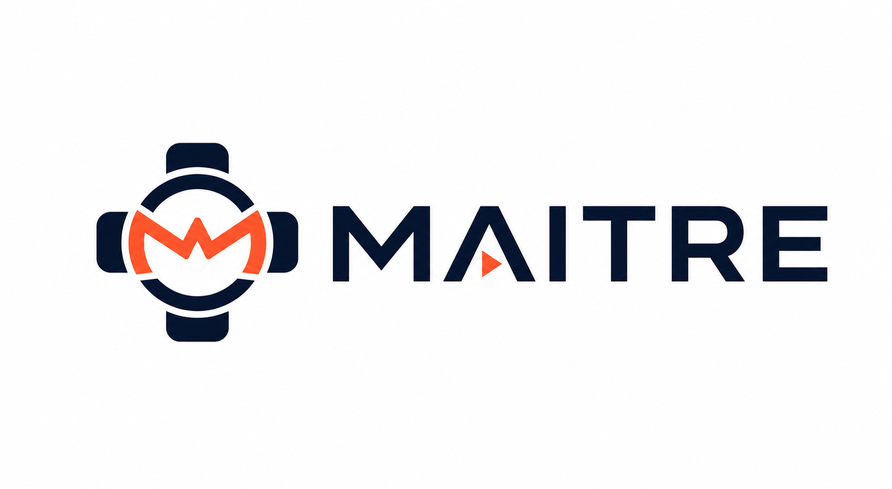

# Maitre

  

Maitre es una plataforma operativa modular para restaurantes argentinos. Está diseñada para acompañar desde un único local hasta grupos multi-marca y multi-sucursal, integrando la operación de salón, reservas, pedidos, cocina, cuentas, pagos, facturación y reputación.

> Los sistemas tradicionales administran mesas, pedidos y cajas. Maitre administra el servicio.

## Visión

Maitre propone un modelo gastronómico que representa la operación real del restaurante y permite activar capacidades por tenant o sucursal. La plataforma combina atención humana y experiencias digitales —como menú, pedidos y solicitud de cuenta mediante QR— sin imponer un modelo de autoservicio.

Sus principales objetivos son:

- Centralizar marcas, entidades fiscales, sucursales, salones, mesas y equipos.
- Unificar reservas, visitas, pedidos, comandas, cuentas, pagos y comprobantes.
- Ofrecer servicios modulares y configurables según las necesidades de cada sucursal.
- Integrar requisitos locales de Argentina, incluyendo ARCA, IVA y medios de pago.
- Relacionar feedback y reputación con los eventos reales de cada visita.
- Evolucionar hacia capacidades predictivas y un maître digital supervisado.

El proyecto sigue un enfoque **Spec-Driven Development (SDD)**: primero se definen contratos formales y verificables; después se implementa y valida el software contra esas especificaciones.

## Stack inicial

- **Frontend:** React.js.
- **Backend:** Node.js.
- **Plataforma:** Vercel para la primera etapa.

La arquitectura mantiene dominio, datos e integraciones desacoplados de Vercel para permitir que frontend, APIs, workers o persistencia migren de forma independiente cuando el crecimiento lo requiera. Los criterios completos están en [Stack técnico y estrategia de plataforma](docs/sdd/TECH_STACK.md).

## Documentación

### Producto y fundamentos

- [Índice de fundamentos](docs/foundation/README.md)
- [Visión y propuesta de valor](docs/foundation/00-vision.md)
- [Principios de producto](docs/foundation/01-product-principles.md)
- [Mercado y modelo de negocio](docs/foundation/02-market-and-business.md)
- [Catálogo de servicios](docs/foundation/03-service-catalog.md)
- [Tenancy y suscripciones](docs/foundation/04-tenancy-subscriptions.md)
- [Glosario del dominio](docs/foundation/05-domain-glossary.md)
- [Modelo de dominio](docs/foundation/06-domain-model.md)
- [Recorridos principales](docs/foundation/07-core-journeys.md)
- [Principios de arquitectura](docs/foundation/10-architecture-principles.md)
- [Mapa visual de arquitectura, componentes y diseño](docs/foundation/18-architecture-components-design-views.md)
- [Roadmap del MVP](docs/foundation/11-mvp-roadmap.md)
- [Decisiones y preguntas abiertas](docs/foundation/13-decisions-and-open-questions.md)

### Especificaciones SDD

- [Cómo empezar](docs/sdd/START_HERE.md)
- [Guía rápida](docs/sdd/QUICK_START.md)
- [Índice maestro de especificaciones](docs/sdd/INDEX.md)
- [Estado general de las specs](docs/sdd/SPECS.md)
- [Estructura de una especificación](docs/sdd/_guides/SPEC_STRUCTURE.md)
- [Formato de especificaciones](docs/sdd/_guides/SPEC_FORMAT.md)
- [Roadmap de especificaciones del MVP](docs/sdd/_guides/00-mvp-specifications-roadmap.md)
- [Prioridades y tareas pendientes](docs/sdd/_guides/01-priority-specs-todo.md)
- [Aplicaciones y dispositivos](docs/sdd/_guides/15-applications-and-devices.md)
- [Contratos de API](docs/sdd/_guides/16-api-specifications.md)
- [Contratos de eventos](docs/sdd/_guides/17-event-specifications.md)
- [Calidad de ingeniería y gates SDD](docs/sdd/spec-207-transversal-engineering-quality/)
- [Arquitectura free tier para el MVP](docs/sdd/spec-208-transversal-zero-cost-mvp/)
- [Arquitectura del monorepo](docs/sdd/spec-209-transversal-monorepo-architecture/)
- [Plataforma de datos e identidad](docs/sdd/spec-210-transversal-data-identity-platform/)
- [Toolchain de implementación](docs/sdd/spec-211-transversal-implementation-toolchain/)
- [Sistema de diseño y accesibilidad](docs/sdd/spec-212-transversal-design-system-accessibility/)
- [Primer corte vertical del MVP](docs/sdd/spec-213-transversal-mvp-walking-skeleton/)
- [Ambientes, configuración y secretos](docs/sdd/spec-214-transversal-environments-configuration-secrets/)
- [Estándares de APIs HTTP](docs/sdd/spec-215-transversal-http-api-standards/)
- [Observabilidad y confiabilidad](docs/sdd/spec-216-transversal-observability-reliability/)
- [Eventos y procesamiento asíncrono](docs/sdd/spec-217-transversal-events-async-processing/)
- [Operación offline y sincronización](docs/sdd/spec-218-transversal-offline-sync/)
- [Seguridad, privacidad y aislamiento multi-tenant](docs/sdd/spec-219-transversal-security-privacy/)
- [Ciclo de vida, backups y disaster recovery](docs/sdd/spec-220-transversal-data-lifecycle-disaster-recovery/)
- [CI/CD y gestión de releases](docs/sdd/spec-221-transversal-ci-cd-release-management/)
- [Operación y despliegue en Vercel](DEPLOYMENT.md)
- [Alcance y secuencia del MVP](docs/sdd/spec-222-transversal-mvp-scope-delivery-plan/)
- [Distribución de estado en tiempo real](docs/sdd/spec-223-transversal-realtime-state-distribution/)
- [Estrategia de testing y datos de prueba](docs/sdd/spec-224-transversal-testing-test-data/)
- [Gobernanza de specs y ADRs](docs/sdd/spec-225-transversal-spec-adr-governance/)
- [Readiness review del primer incremento](docs/sdd/I0_READINESS_REVIEW.md)
- [Revisión de contratos funcionales de I0](docs/sdd/I0_FUNCTIONAL_CONTRACT_REVIEW.md)
- [Registro de decisiones arquitectónicas](docs/adr/)
- [Estado operativo y runbooks](docs/operations/)
- [Cierre de gaps del MVP — 30 de julio de 2026](docs/operations/mvp-gap-closure-2026-07-30.md)
- [Spikes de validación de plataforma I0](docs/sdd/spec-226-transversal-i0-platform-validation-spikes/)

## Roadmap resumido

1. Plataforma fundacional: tenants, sucursales, usuarios, catálogo y suscripciones.
2. Operación mínima: salón, jornadas, visitas, pedidos y cocina.
3. Adquisición y autoservicio: reservas, experiencia Guest y QR híbrido.
4. Dinero y fiscalidad: caja, pagos, comprobantes y ARCA.
5. Integraciones y reputación: conectores, reseñas y migraciones.
6. Inteligencia: predicción operacional y automatización supervisada.

## Estado del repositorio

Este repositorio contiene las especificaciones y la implementación activa de Maitre: API, seis
aplicaciones web, módulos de dominio, adaptadores, migraciones y pruebas automatizadas. Las
especificaciones siguen actuando como contrato de la implementación.

Los pull requests ejecutan Quality, CodeQL y los E2E afectados, resumidos por el check estable
`E2E gate`. Después de un merge a `main`, el workflow `End-to-end` despliega en Vercel únicamente
la API o las aplicaciones alcanzadas por el cambio, siempre que `Quality gate` y `E2E gate` pasen;
los cambios compartidos usan una selección conservadora completa. Consulta
[Operación y despliegue en Vercel](DEPLOYMENT.md).

## Estado operativo local actual

- Todo ambiente compartido del backend exige explícitamente Supabase para persistencia y auth,
  credencial server-side y una allowlist CORS exacta; una configuración incompleta aborta startup
  y deployment.
- En el proyecto Supabase conectado ya hay datos reales mínimos para probar organización, floor, reservations, ordering, kitchen y cash.
- Los adapters `memory` y `fixture` quedan restringidos a desarrollo local y tests herméticos; no
  son un fallback permitido para preview, development compartido, demo ni production.
- OpenAPI versionado, Problem Details RFC 9457, breaking-change detection, telemetría OTLP portable,
  señales de outbox/audit y el journey durable MVP-J-001 forman parte de los gates de CI.
- El backend remoto de telemetría, dashboards, alertas y SLOs continúa `NOT_OPERATIONAL` para el
  MVP Demo según ADR-005.
- El rollout fiscal ya quedó aplicado en el proyecto Supabase conectado mediante [supabase/migrations/20260727143000_fiscal_domain.sql](supabase/migrations/20260727143000_fiscal_domain.sql), con schema cache recargado y seed fiscal operativo.
- El flujo fiscal técnico ya fue validado en vivo el **27 de julio de 2026**: creación, validación, emisión y QR de una `FACTURA_A` sobre Supabase. La autorización ARCA sigue siendo **simulada** (`FISCAL_ARCA_DRIVER=simulated`), por lo que el CAE emitido no es legal/fiscal real.
- La app `host` ya quedó re-alineada como superficie de recepción/maître; su shell y documentación ya no presentan el rol como `waiter/mozo`.
