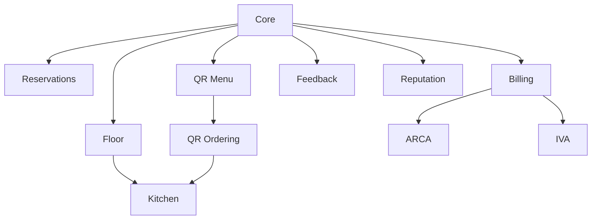

# Catálogo de servicios

## Reglas del catálogo

Cada definición de servicio debe declarar:

- Código estable.
- Nombre comercial.
- Descripción.
- Versión.
- Alcance de contratación.
- Dependencias.
- Precio y moneda.
- Límites incluidos.
- Período de prueba.
- Política de activación y baja.
- Conservación de datos.
- Países habilitados.

Los precios y condiciones se versionan. Un cambio no modifica retroactivamente contratos vigentes.

## Servicios fundacionales

| Código | Servicio | Alcance | Dependencia |
| --- | --- | --- | --- |
| `CORE` | Maitre Core | Tenant | Obligatorio |
| `BRANCHES` | Maitre Branches | Capacidad | Core |
| `IDENTITY` | Maitre Identity | Tenant | Core |
| `CONNECT` | Maitre Connect | Tenant/sucursal | Core |

Core incluye tenant, marcas, entidades fiscales, sucursales, usuarios, roles, auditoría, catálogo básico, dashboard comercial y entitlements.

## Operación gastronómica

| Código | Servicio | Alcance | Dependencia |
| --- | --- | --- | --- |
| `FLOOR` | Maitre Floor | Sucursal | Core + Branch |
| `RESERVATIONS` | Maitre Reservations | Sucursal | Core + Branch |
| `SHIFTS` | Maitre Shifts | Sucursal | Core + Branch |
| `KITCHEN` | Maitre Kitchen | Sucursal | Floor o QR Ordering |
| `QR_MENU` | Maitre QR Menu | Sucursal | Core |
| `QR_ORDERING` | Maitre QR Ordering | Sucursal | QR Menu |
| `GUEST` | Maitre Guest | Sucursal | Floor o Reservations |
| `DELIVERY` | Maitre Delivery | Sucursal | Core + Kitchen recomendado |
| `INVENTORY` | Maitre Inventory | Sucursal/depósito | Core |

### Floor

Salones, mesas, combinaciones, visitas, ocupaciones, plazas, asignaciones, pedidos y precuentas.

### Reservations

Agenda, disponibilidad, reservas remotas, retenciones, lista de espera, señas, confirmaciones, cancelaciones y no-shows.

### Shifts

Plantillas de servicio, jornadas, turnos laborales, asistencia y asignaciones.

### Kitchen

Centros de preparación, estaciones, comandas, estados, despacho y tiempos.

### QR Menu

Carta pública, categorías, productos, precios, fotos, idiomas, ingredientes, alérgenos y códigos QR.

### QR Ordering

Pedidos desde la mesa, aprobación opcional, operación híbrida, solicitud de asistencia y cuenta.

## Caja y fiscalidad

| Código | Servicio | Alcance | Dependencia |
| --- | --- | --- | --- |
| `CASH` | Maitre Cash | Sucursal | Core |
| `BILLING` | Maitre Billing | Sucursal/entidad fiscal | Core |
| `PAYMENTS` | Maitre Payments | Tenant/sucursal | Cash o Billing |
| `ARCA` | Maitre ARCA | Entidad fiscal | Billing |
| `IVA` | Maitre IVA | Entidad fiscal | Billing |

Cash administra cajas y sesiones. Billing administra cuentas y documentos. Payments integra medios de pago. ARCA solicita autorización fiscal y mantiene puntos de venta. IVA produce registración y conciliación.

## Experiencia y crecimiento

| Código | Servicio | Alcance | Dependencia |
| --- | --- | --- | --- |
| `FEEDBACK` | Maitre Feedback | Sucursal | Core |
| `REPUTATION` | Maitre Reputation | Sucursal/conector | Core |
| `CRM` | Maitre CRM | Marca/tenant | Core |
| `LOYALTY` | Maitre Loyalty | Marca/tenant | CRM recomendado |

## Inteligencia

| Código | Servicio | Alcance | Dependencia |
| --- | --- | --- | --- |
| `AI_ASSISTANT` | Maitre AI Assistant | Tenant/sucursal | Core |
| `AI_FORECAST` | Maitre AI Forecast | Sucursal | Datos históricos |
| `AI_PROMISE` | Maitre AI Promise | Sucursal | Reservations + Kitchen recomendado |
| `AI_KITCHEN` | Maitre AI Kitchen | Sucursal | Kitchen |
| `AI_AHEAD` | Maitre Ahead | Sucursal | Floor + Reservations + Kitchen |
| `AI_AUTOPILOT` | Maitre Autopilot | Sucursal | Ahead + políticas de autorización |

## Dependencias principales



## Ejemplo de contratación

```text
Tenant: Grupo Aguero

Palermo
✓ Floor
✓ Reservations
✓ QR Menu
✓ QR Ordering
✓ Kitchen
✓ Cash
✓ Billing
✓ ARCA

Belgrano
✓ Floor
✓ QR Menu
✓ Kitchen
✓ Cash
✗ Reservations
✗ QR Ordering

Tenant completo
✓ Feedback
✓ Reputation: Google
```
