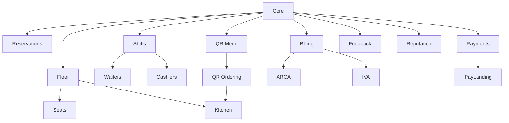

# Catálogo de servicios

## Reglas del catálogo

Cada definición de servicio debe declarar:

- Código estable.
- Nombre comercial.
- Descripción.
- Versión.
- Tipo: `SERVICE` (on/off) o `QUANTITY` (unidades contratadas de un recurso).
- Alcance de contratación.
- Dependencias.
- Precio y moneda (precio unitario si es `QUANTITY`, con franjas o descuentos por volumen opcionales).
- Límites incluidos.
- Período de prueba.
- Política de activación y baja.
- Conservación de datos.
- Países habilitados.

Los precios y condiciones se versionan. Un cambio no modifica retroactivamente contratos vigentes.

Todo ítem del catálogo, sea `SERVICE` o `QUANTITY`, se contrata y descontrata de forma independiente y en cualquier momento.

Cada ítem también declara una descripción comercial extensa y una lista de beneficios. Estas
propiedades viven en el catálogo persistido y son la fuente de verdad para la pantalla de
suscripción.

## Paquetes recomendados

Los paquetes son composiciones versionadas de ítems del catálogo aplicadas al tenant. Facilitan una
configuración inicial, pero no crean planes rígidos: después de aplicarlos, cada servicio y cantidad
continúa siendo independiente. Los ítems con alcance sucursal se replican en todas las sucursales
actuales; el paquete en sí no pertenece a una sucursal.

| Código | Enfoque | Composición inicial |
| --- | --- | --- |
| `BASE_OPERATIVA` | Mínimo para comenzar | Core, 1 sucursal, Floor, 20 plazas y Cash |
| `ESENCIAL` | Alternativa económica con crecimiento comercial | Base + Reservations, QR Menu, 40 plazas, 4 mozos y 1 cajero |
| `GESTION_INTEGRAL` | Operación media conectada | Esencial ampliado con Shifts, Kitchen, QR Ordering, 80 plazas, 8 mozos y 2 cajeros |

La composición se almacena en `subscription_catalog_packages.items`; React nunca define qué
incluye un paquete.

## Servicios fundacionales

| Código | Servicio | Tipo | Alcance | Dependencia |
| --- | --- | --- | --- | --- |
| `CORE` | Maitre Core | Service | Tenant | Obligatorio |
| `BRANCHES` | Maitre Branches | Quantity | Tenant | Core |
| `IDENTITY` | Maitre Identity | Service | Tenant | Core |
| `CONNECT` | Maitre Connect | Service | Tenant/sucursal | Core |

Core incluye tenant, marcas, entidades fiscales, sucursales, usuarios, roles, auditoría, catálogo básico, dashboard comercial y entitlements.

## Operación gastronómica

| Código | Servicio | Tipo | Alcance | Dependencia |
| --- | --- | --- | --- | --- |
| `FLOOR` | Maitre Floor | Service | Sucursal | Core + Branch |
| `SEATS` | Plazas | Quantity | Sucursal | Floor |
| `RESERVATIONS` | Maitre Reservations | Service | Sucursal | Core + Branch |
| `SHIFTS` | Maitre Shifts | Service | Sucursal | Core + Branch |
| `SHIFT_SLOTS` | Turnos | Quantity | Sucursal | Shifts |
| `WAITERS` | Mozos | Quantity | Sucursal | Shifts o Floor |
| `CASHIERS` | Cajeros | Quantity | Sucursal | Shifts o Cash |
| `KITCHEN` | Maitre Kitchen | Service | Sucursal | Floor o QR Ordering |
| `QR_MENU` | Maitre QR Menu | Service | Sucursal | Core |
| `QR_ORDERING` | Maitre QR Ordering | Service | Sucursal | QR Menu |
| `GUEST` | Maitre Guest | Service | Sucursal | Floor o Reservations |
| `DELIVERY` | Maitre Delivery | Service | Sucursal | Core + Kitchen recomendado |
| `INVENTORY` | Maitre Inventory | Service | Sucursal/depósito | Core |

### Plazas, mozos y cajeros

Recursos por cantidad, con alcance de sucursal y precio por unidad:

- `SEATS`: plazas habilitadas en el plano de sala (capacidad de comensales simultáneos). Depende de Floor.
- `SHIFT_SLOTS`: turnos configurables por jornada (ej. almuerzo, merienda, cena). Depende de Shifts.
- `WAITERS`: mozos activos habilitados para operar. Depende de Shifts o Floor.
- `CASHIERS`: cajeros activos o cajas concurrentes habilitadas, según definición comercial vigente. Depende de Shifts o Cash.

Se contratan y ajustan de forma independiente entre sí y respecto de cualquier otro servicio u otra sucursal del mismo tenant.

### Floor

Salones, mesas, combinaciones, visitas, ocupaciones, plazas, asignaciones, pedidos y precuentas.

### Reservations

Agenda, disponibilidad, reservas remotas, retenciones, lista de espera, señas, confirmaciones, cancelaciones y no-shows.

### Shifts

Plantillas de servicio, jornadas, turnos laborales, asistencia y asignaciones.

### Kitchen

Centros de preparación, estaciones, comandas, estados, despacho y tiempos.

### QR Menu

Carta pública, categorías, productos, precios, fotos, idiomas, ingredientes, alérgenos y códigos QR.

### QR Ordering

Pedidos desde la mesa, aprobación opcional, operación híbrida, solicitud de asistencia y cuenta.

## Caja y fiscalidad

| Código | Servicio | Tipo | Alcance | Dependencia |
| --- | --- | --- | --- | --- |
| `CASH` | Maitre Cash | Service | Sucursal | Core |
| `BILLING` | Maitre Billing | Service | Sucursal/entidad fiscal | Core |
| `PAYMENTS` | Maitre Payments | Service | Tenant/sucursal | Cash o Billing |
| `PAYLANDING` | Maitre PayLanding | Service | Tenant/sucursal/conector | Payments |
| `ARCA` | Maitre ARCA | Service | Entidad fiscal | Billing |
| `IVA` | Maitre IVA | Service | Entidad fiscal | Billing |

Cash administra cajas y sesiones. Billing administra cuentas y documentos. Payments integra medios de pago. ARCA solicita autorización fiscal y mantiene puntos de venta. IVA produce registración y conciliación.

### PayLanding

Página/link de cobro (landing de pago) para cuentas, delivery o reservas con seña. Se activa como servicio base y cada medio de pago se contrata como conector independiente dentro de PayLanding:

| Conector | Proveedor |
| --- | --- |
| `PAYLANDING.MERCADOPAGO` | Mercado Pago |
| `PAYLANDING.NARANJA_X` | Tarjeta Naranja / Naranja X |
| `PAYLANDING.MODO` | MODO |
| `PAYLANDING.TODO_PAGO` | Todo Pago |

Cada conector tiene su propia activación, credenciales y alta/baja independiente, igual que `REPUTATION.CONNECTORS.*`. El servicio `PAYLANDING` puede depender de al menos un conector activo para considerarse operativo.

## Experiencia y crecimiento

| Código | Servicio | Tipo | Alcance | Dependencia |
| --- | --- | --- | --- | --- |
| `FEEDBACK` | Maitre Feedback | Service | Sucursal | Core |
| `REPUTATION` | Maitre Reputation | Service | Sucursal/conector | Core |
| `CRM` | Maitre CRM | Service | Marca/tenant | Core |
| `LOYALTY` | Maitre Loyalty | Service | Marca/tenant | CRM recomendado |

## Inteligencia

| Código | Servicio | Tipo | Alcance | Dependencia |
| --- | --- | --- | --- | --- |
| `AI_ASSISTANT` | Maitre AI Assistant | Service | Tenant/sucursal | Core |
| `AI_FORECAST` | Maitre AI Forecast | Service | Sucursal | Datos históricos |
| `AI_PROMISE` | Maitre AI Promise | Service | Sucursal | Reservations + Kitchen recomendado |
| `AI_KITCHEN` | Maitre AI Kitchen | Service | Sucursal | Kitchen |
| `AI_AHEAD` | Maitre Ahead | Service | Sucursal | Floor + Reservations + Kitchen |
| `AI_AUTOPILOT` | Maitre Autopilot | Service | Sucursal | Ahead + políticas de autorización |

## Dependencias principales



## Ejemplo de contratación

```text
Tenant: Grupo Aguero

Palermo
✓ Floor
✓ 12 plazas
✓ 8 mozos
✓ Reservations
✓ QR Menu
✓ QR Ordering
✓ Kitchen
✓ Cash
✓ 3 cajeros
✓ Billing
✓ ARCA

Belgrano
✓ Floor
✓ 8 plazas
✓ 4 mozos
✓ QR Menu
✓ Kitchen
✓ Cash
✓ 1 cajero
✗ Reservations
✗ QR Ordering

Tenant completo
✓ Feedback
✓ Reputation: Google
```
