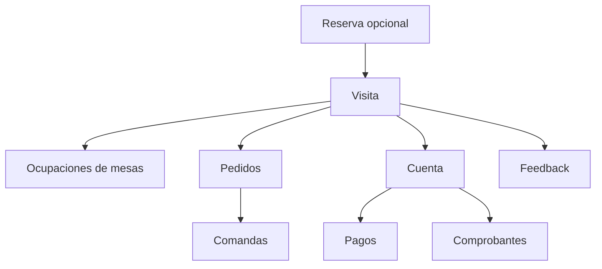

# Modelo de dominio

## Contextos principales

### Organización

```text
Tenant
Marca
EntidadFiscal
Sucursal
Salon
Mesa
CombinacionMesa
```

### Identidad

```text
Usuario
Empleado
Rol
Permiso
Membership
AsignacionSucursal
```

### Servicio de salón

```text
PlantillaServicio
JornadaServicio
Plaza
AsignacionPlaza
Visita
OcupacionMesa
```

### Reservas

```text
Reserva
RetencionDisponibilidad
GrupoCliente
ListaEspera
Seña
PoliticaCancelacion
```

### Pedidos y producción

```text
Menu
Producto
Precio
DisponibilidadProducto
Pedido
ItemPedido
Comanda
CentroPreparacion
Estacion
```

### Caja y fiscalidad

```text
Cuenta
Subcuenta
Pago
Caja
SesionCaja
MovimientoCaja
EntidadFiscal
PuntoVentaFiscal
ComprobanteFiscal
PeriodoIVA
```

### Experiencia

```text
Feedback
ExternalReview
ReputationCase
ResponseDraft
ExternalLocationMapping
```

### Plataforma comercial

```text
ServiceDefinition
ServiceVersion
ServiceDependency
PlanVersion
Subscription
SubscriptionItem
SubscriptionScope
Entitlement
Quota
UsageRecord
ProvisioningJob
```

## Relación operativa central



## Estados iniciales

### Reserva

```text
DRAFT → HELD → CONFIRMED → ARRIVED → SEATED → COMPLETED
                     └→ CANCELLED
                     └→ NO_SHOW
```

### Visita

```text
WAITING → SEATED → ORDERING → IN_SERVICE → CHECK_REQUESTED → PAYING → CLOSED
```

### Pedido

```text
DRAFT → SUBMITTED → ACCEPTED → IN_PREPARATION → READY → DELIVERED
```

El pedido puede estar parcialmente listo o cancelado con razones y autorización.

### Cuenta

```text
OPEN → PARTIALLY_PAID → PAID
```

### Mesa en una jornada

```text
AVAILABLE
RESERVED
OCCUPIED
PAYING
CLEANING
BLOCKED
```

El estado debe derivarse de reservas, ocupaciones y bloqueos; no ser una verdad aislada.

## Reglas invariantes

- Una mesa pertenece a un salón en un momento determinado.
- Una plaza pertenece a una jornada y agrupa mesas.
- Una visita puede ocupar varias mesas.
- Una reserva puede existir sin mesa asignada.
- Una ocupación tiene inicio y fin.
- Una mesa no puede tener ocupaciones incompatibles simultáneas.
- Una comanda deriva de uno o más ítems confirmados.
- Una cuenta puede recibir varios pagos.
- Un comprobante fiscal pertenece a una entidad fiscal y punto de venta.
- Desactivar servicios no altera históricos.
- Todo cambio sensible registra actor, origen, fecha y motivo.

## Eventos iniciales

```text
TenantCreated
ServiceActivated
BranchCreated
ServiceDayOpened
ReservationCreated
ReservationConfirmed
GuestArrived
VisitOpened
TableAssigned
OrderSubmitted
KitchenTicketCreated
DishPrepared
DishDelivered
CheckRequested
PaymentCompleted
FiscalDocumentAuthorized
VisitClosed
FeedbackReceived
ExternalReviewReceived
```

## Diagrama entidad-relación (schema real)

Extraído directamente de `supabase/migrations/*.sql` (fuente de verdad), no del
modelo conceptual de arriba. Es un subconjunto curado: cubre la columna
vertebral operativa (organización, identidad, salón, pedidos, cocina, caja,
fiscal, reservas, suscripción, workforce) con sus relaciones principales.
Tablas auxiliares de bajo valor de lectura (ajustes puntuales, jobs de export,
alerts) se omiten para mantener el diagrama legible; el detalle completo de
columnas está en las migraciones.

```mermaid
erDiagram
    ORGANIZATION_TENANTS ||--o{ ORGANIZATION_BRANDS : "tiene"
    ORGANIZATION_TENANTS ||--o{ ORGANIZATION_FISCAL_ENTITIES : "tiene"
    ORGANIZATION_TENANTS ||--o{ ORGANIZATION_BRANCHES : "tiene"
    ORGANIZATION_BRANDS ||--o{ ORGANIZATION_BRANCHES : "opera"
    ORGANIZATION_FISCAL_ENTITIES ||--o{ ORGANIZATION_BRANCHES : "factura"
    ORGANIZATION_BRANCHES ||--o{ ORGANIZATION_SALONS : "contiene"
    ORGANIZATION_SALONS ||--o{ ORGANIZATION_TABLES : "contiene"

    IDENTITY_USERS ||--o{ IDENTITY_MEMBERSHIPS : "tiene"
    ORGANIZATION_TENANTS ||--o{ IDENTITY_MEMBERSHIPS : "otorga"
    IDENTITY_MEMBERSHIPS ||--o{ IDENTITY_MEMBERSHIP_BRANCHES : "alcanza"
    IDENTITY_MEMBERSHIPS ||--o{ IDENTITY_MEMBERSHIP_ROLES : "asigna"
    ORGANIZATION_BRANCHES ||--o{ IDENTITY_MEMBERSHIP_BRANCHES : "restringe"

    ORGANIZATION_BRANCHES ||--o{ WORKFORCE_EMPLOYMENTS : "emplea"
    WORKFORCE_EMPLOYMENTS ||--o{ WORKFORCE_WORK_SHIFTS : "cubre"
    WORKFORCE_WORK_SHIFTS ||--o{ WORKFORCE_SHIFT_ASSIGNMENTS : "asigna"
    WORKFORCE_WORK_SHIFTS ||--o{ WORKFORCE_TIME_ENTRIES : "registra"
    WORKFORCE_TIME_ENTRIES ||--o{ WORKFORCE_BREAK_LOGS : "pausa"

    ORGANIZATION_BRANCHES ||--o{ FLOOR_SERVICE_PERIODS : "abre"
    ORGANIZATION_SALONS ||--o{ FLOOR_PLAZAS : "agrupa"
    FLOOR_PLAZAS ||--o{ FLOOR_PLAZA_TABLES : "incluye"
    ORGANIZATION_TABLES ||--o{ FLOOR_PLAZA_TABLES : "pertenece"
    WORKFORCE_EMPLOYMENTS ||--o{ FLOOR_PLAZAS : "atiende"
    FLOOR_SERVICE_PERIODS ||--o{ FLOOR_VISITS : "enmarca"
    ORGANIZATION_TABLES ||--o{ FLOOR_VISITS : "ocupa"
    RESERVATIONS_RESERVATIONS ||--o| FLOOR_VISITS : "origina"
    FLOOR_VISITS ||--o{ FLOOR_OCCUPANCIES : "detalla"
    FLOOR_VISITS ||--o| FLOOR_CHECKS : "genera"
    FLOOR_CHECKS ||--o{ FLOOR_PAYMENTS : "salda"

    CATALOG_MENUS ||--o{ CATALOG_CATEGORIES : "organiza"
    CATALOG_CATEGORIES ||--o{ CATALOG_PRODUCTS : "lista"
    FLOOR_VISITS ||--o{ ORDERING_ORDERS : "genera"
    CATALOG_PRODUCTS ||--o{ ORDERING_ORDERS : "compone"
    ORDERING_ORDERS ||--o{ ORDERING_SPECIAL_REQUESTS : "anota"
    ORDERING_ORDERS ||--o{ ORDERING_KITCHEN_TICKETS : "dispara"
    KITCHEN_STATIONS ||--o{ KITCHEN_COMMANDS : "procesa"
    ORDERING_KITCHEN_TICKETS ||--o{ KITCHEN_COMMANDS : "produce"
    KITCHEN_COMMANDS ||--o{ KITCHEN_ALERTS : "puede generar"

    ORGANIZATION_BRANCHES ||--o{ CASH_REGISTERS : "tiene"
    CASH_REGISTERS ||--o{ CASH_SESSIONS : "abre"
    CASH_SESSIONS ||--o{ CASH_MOVEMENTS : "registra"
    CASH_SESSIONS ||--o| CASH_RECONCILIATIONS : "cierra"
    FLOOR_PAYMENTS ||--o| CASH_MOVEMENTS : "impacta"
    CASH_DISCOUNTS ||--o{ CASH_DISCOUNT_APPLICATIONS : "se aplica en"
    FLOOR_CHECKS ||--o{ CASH_DISCOUNT_APPLICATIONS : "recibe"

    ORGANIZATION_FISCAL_ENTITIES ||--o{ FISCAL_POINTS_OF_SALE : "habilita"
    ORGANIZATION_BRANCHES ||--o{ FISCAL_POINTS_OF_SALE : "usa"
    ORGANIZATION_FISCAL_ENTITIES ||--o{ FISCAL_CERTIFICATES : "posee"
    FISCAL_POINTS_OF_SALE ||--o{ FISCAL_INVOICES : "numera"
    FLOOR_CHECKS ||--o| FISCAL_INVOICES : "factura"
    FISCAL_INVOICES ||--o{ FISCAL_AUTHORIZATION_ATTEMPTS : "intenta autorizar"
    FISCAL_INVOICES ||--o{ FISCAL_INVOICE_DELIVERIES : "envía"
    FISCAL_INVOICE_TEMPLATES ||--o{ FISCAL_INVOICES : "formatea"
    FISCAL_TAX_RATES ||--o{ FISCAL_INVOICES : "aplica"

    RESERVATIONS_GUESTS ||--o{ RESERVATIONS_RESERVATIONS : "reserva"
    ORGANIZATION_BRANCHES ||--o{ RESERVATIONS_RESERVATIONS : "recibe"
    RESERVATIONS_RESERVATIONS ||--o{ RESERVATIONS_NOTIFICATION_INTENTS : "notifica"
    RESERVATIONS_CANCELLATION_POLICIES ||--o{ RESERVATIONS_RESERVATIONS : "rige"
    ORGANIZATION_BRANCHES ||--o{ RESERVATIONS_WAITLIST_ENTRIES : "encola"

    ORGANIZATION_TENANTS ||--o{ SUBSCRIPTION_SUBSCRIPTIONS : "contrata"
    SUBSCRIPTION_SUBSCRIPTIONS ||--o{ SUBSCRIPTION_ITEMS : "incluye"
    SUBSCRIPTION_SUBSCRIPTIONS ||--o{ SUBSCRIPTION_ENTITLEMENTS : "otorga"
    SUBSCRIPTION_SUBSCRIPTIONS ||--o{ SUBSCRIPTION_QUOTAS : "limita"
    SUBSCRIPTION_CATALOG_PACKAGES ||--o{ SUBSCRIPTION_CATALOG_ITEMS : "empaqueta"
    SUBSCRIPTION_CATALOG_ITEMS ||--o{ SUBSCRIPTION_ITEMS : "define"
```



Notas de lectura:

- `organization.*` usa FKs compuestas `(tenant_id, id)` para forzar aislamiento
  multi-tenant a nivel de base — no solo `tenant_id` como columna suelta.
- `FLOOR_VISITS` puede originarse en una reserva (`RESERVATIONS_RESERVATIONS`)
  o directamente como walk-in (relación opcional, `o|`).
- `FISCAL_INVOICES` cuelga de `FLOOR_CHECKS` (una cuenta cerrada dispara la
  facturación), no de `FLOOR_VISITS` directamente.
- Tablas omitidas del diagrama por brevedad: `workforce_break_adjustments`,
  `workforce_time_adjustments`, `workforce_time_export_jobs`,
  `workforce_labor_policy_versions`, `platform.outbox`, `audit_logs`,
  `brand_presentations`/`brand_assets`/`branch_presentations`,
  `ordering_capability_tokens`. Están en las migraciones correspondientes.
