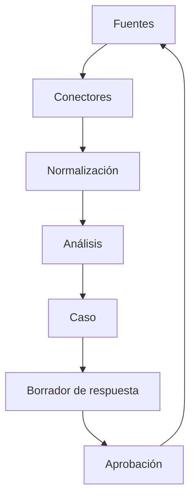

# Feedback y reputación

## Objetivo

Centralizar la voz del comensal, tanto la obtenida directamente como la publicada en plataformas externas, y convertirla en acciones operativas.

## Servicios separados

### Maitre Feedback

Obtiene opinión mediante:

- QR de mesa.
- Encuesta posterior al pago.
- Enlace por WhatsApp o correo.
- Tablet del local.
- Reclamo cargado por personal.

Puede relacionarse con sucursal, reserva, visita, mesa, jornada, productos y tiempos.

### Maitre Reputation

Sincroniza reseñas externas, normaliza formatos, ayuda a responder y compara sucursales.

## Conectores prioritarios

1. **Google Business Profile:** primer conector. La API permite listar y responder reseñas de ubicaciones autorizadas.
2. **Tripadvisor:** condicionado a disponibilidad y acuerdos de acceso.
3. **Meta/Facebook:** conector basado en capacidades vigentes de la API.
4. **Yelp:** prioridad baja para Argentina y sujeto a planes de API.
5. **PedidosYa/Rappi:** solo mediante APIs de partner, acuerdos o exportaciones permitidas.

No se utilizará scraping como base de una capacidad comercial comprometida.

## Mapeo externo

```text
ExternalLocationMapping
- tenantId
- branchId
- provider
- externalAccountId
- externalLocationId
- connectionId
```

## Reseña normalizada

```text
ExternalReview
- provider
- externalReviewId
- branchId
- rating
- title
- comment
- reviewerPublicName
- publishedAt
- ownerResponse
- sourceUrl
- language
- rawPayload
- synchronizedAt
```

## Flujo



## Capacidades de IA

- Idioma y sentimiento.
- Categorías: comida, atención, demora, limpieza, ambiente, precio, reserva, pago y delivery.
- Urgencia y riesgo reputacional.
- Resumen por sucursal.
- Detección de temas recurrentes.
- Borrador de respuesta con tono de marca.
- Comparación entre feedback interno y reseñas públicas.

Las respuestas se aprueban manualmente en las primeras versiones. La publicación automática requiere política explícita.

## Vinculación operacional

Cuando exista una relación confiable y autorizada con una visita, Maitre podrá contrastar opinión y eventos:

```text
Comentario: “esperamos una hora”
Pedido confirmado: 21:14
Último plato entregado: 22:05
Tiempo efectivo: 51 minutos
```

No se intentará identificar de manera especulativa al autor de una reseña externa.

## Métricas

- Calificación por fuente, marca y sucursal.
- Tiempo de respuesta.
- Porcentaje de reseñas respondidas.
- Distribución por categoría.
- Incidentes recurrentes.
- Evolución antes y después de acciones correctivas.
- Diferencia entre feedback privado y reseña pública.

## Entitlements de ejemplo

```text
FEEDBACK.ACCESS = true
REPUTATION.ACCESS = true
REPUTATION.CONNECTORS.GOOGLE = true
REPUTATION.AI_ANALYSIS = true
REPUTATION.AI_RESPONSES = true
REPUTATION.MONTHLY_REVIEWS.MAX = 5000
```
