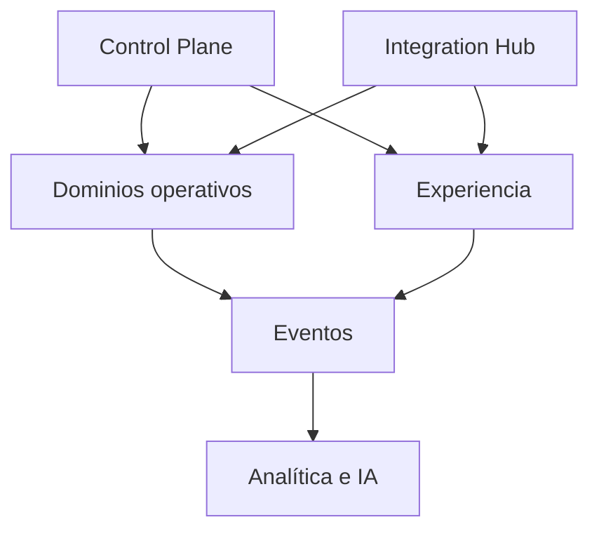

# Principios de arquitectura

## Objetivo

Soportar una plataforma SaaS modular sin confundir límites comerciales, límites de dominio y unidades de despliegue.

## Planos lógicos



## Control Plane

- Tenants.
- Catálogo.
- Precios y planes.
- Suscripciones.
- Entitlements.
- Provisioning.
- Medición de uso.
- Facturación de Maitre.
- Trials, upgrades y downgrades.

## Data Plane operacional

- Organización.
- Salón.
- Reservas.
- Pedidos.
- Cocina.
- Turnos.
- Caja.
- Facturación.
- Fiscalidad.
- Feedback y reputación.

## Integration Hub

- OAuth y credenciales cifradas.
- Adaptadores por proveedor.
- Webhooks.
- Sincronización y cursores.
- Rate limits.
- Reintentos e idempotencia.
- Monitoreo y estado de conexión.
- Conservación opcional del payload original.

## Plataforma de eventos

Los dominios publican hechos relevantes mediante un esquema versionado. Los consumidores deben ser idempotentes.

## Aislamiento multi-tenant

- Todo dato operacional posee tenant explícito.
- La autorización valida tenant y alcance de sucursal.
- Los procesos asincrónicos conservan contexto de tenant.
- Los datos de un tenant no se utilizan para otro sin anonimización y base legal.
- Las pruebas incluyen intentos de acceso cruzado.

## Identidad y autorización

- Una identidad puede pertenecer a varios tenants.
- Los roles pueden limitarse por sucursal.
- Las acciones de alto riesgo requieren permisos específicos.
- Toda elevación o impersonación queda auditada.

## Disponibilidad y operación local

La primera implementación será cloud-first en Vercel, con frontend React.js y backend Node.js. Las capacidades offline/locales siguen siendo necesarias para las funciones críticas y deben definir:

- Qué operaciones funcionan sin Internet.
- Cómo se asignan identificadores.
- Cómo se resuelven conflictos.
- Qué funciones fiscales requieren conexión.
- Cómo se sincronizan comandas y pagos.

## Plataforma inicial y portabilidad

- Vercel es la plataforma de despliegue inicial, no un límite permanente del producto.
- React.js es la base de las aplicaciones web y Node.js la base de APIs, webhooks y procesos compatibles.
- El dominio y los servicios de aplicación no importan SDKs de Vercel ni dependen de su ciclo de vida.
- Base de datos, objetos, identidad, eventos, jobs, secretos y observabilidad se acceden mediante contratos propios y adaptadores reemplazables.
- La configuración se inyecta por ambiente y no utiliza identificadores de plataforma como identidad de negocio.
- Builds, tests y migraciones deben poder ejecutarse fuera de Vercel.
- Frontend, APIs, workers, datos y almacenamiento pueden migrarse por separado.

La plataforma se reevaluará por requisitos medidos: conexiones persistentes, workers continuos, procesos largos, throughput, residencia de datos, red privada, operación local, límites técnicos o costo. La plataforma destino se decidirá entonces; no se fija anticipadamente.

## Estrategia de implementación

Se recomienda comenzar con un monolito modular o pocos despliegues bien delimitados. Candidatos de módulos:

```text
tenancy
subscription
identity
organization
floor
reservations
catalog
ordering
kitchen
shifts
cash
billing
fiscal
feedback
reputation
integrations
analytics
```

La extracción a microservicio debe justificarse por escalado, independencia, riesgo, equipo o integración, no por coincidir con un servicio comercial.

El monolito modular inicial puede desplegarse en Vercel siempre que sus módulos conserven límites de dominio y puedan ejecutarse en un proceso Node.js o contenedor estándar fuera de la plataforma.

## Consistencia

- Operaciones internas críticas usan transacciones locales cuando sea posible.
- Integraciones y eventos utilizan outbox/inbox o mecanismo equivalente.
- Pagos y facturación requieren idempotencia fuerte.
- Los estados derivados se reconstruyen desde fuentes autoritativas.

## Auditoría

Registrar:

- Actor humano o automático.
- Tenant y sucursal.
- Acción.
- Estado anterior y nuevo.
- Fecha y origen.
- Motivo.
- Correlación con pedido, cuenta, pago o comprobante.

## Seguridad

- Secretos y certificados cifrados.
- Separación de credenciales por entidad fiscal o conector.
- Rotación y revocación.
- Mínimo privilegio.
- Logs sin datos sensibles innecesarios.
- Exportación y eliminación conforme a políticas aplicables.

## Observabilidad

- Trazas por visita y pedido.
- Métricas por tenant y sucursal sin exponer datos cruzados.
- Estado de conectores.
- Colas y reintentos.
- Latencia de cocina y pagos.
- Auditoría de decisiones de IA.
