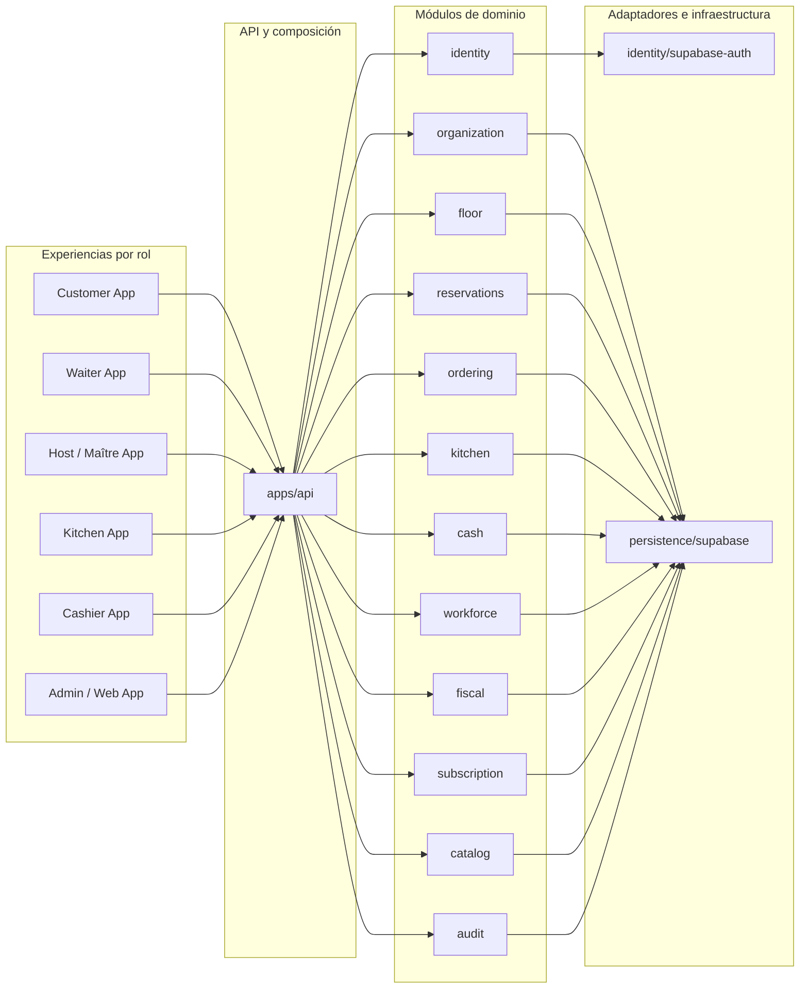
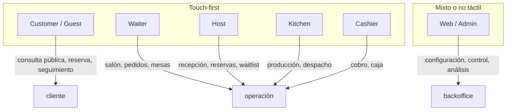
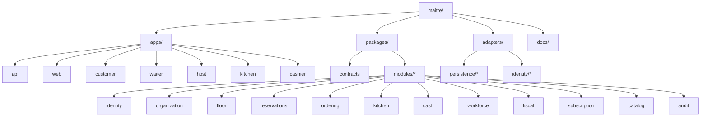
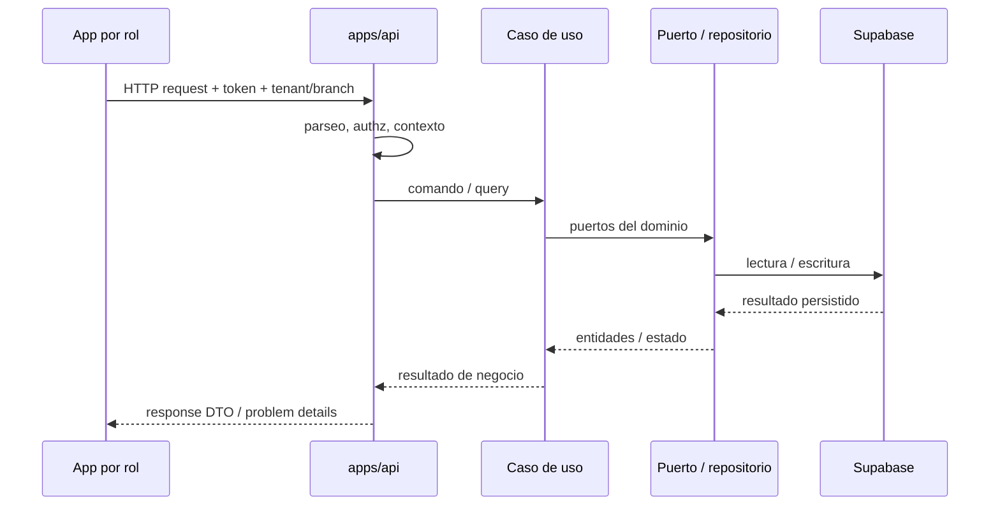
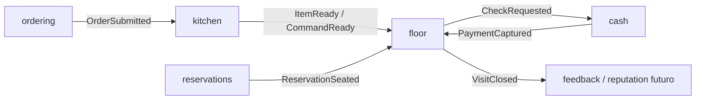
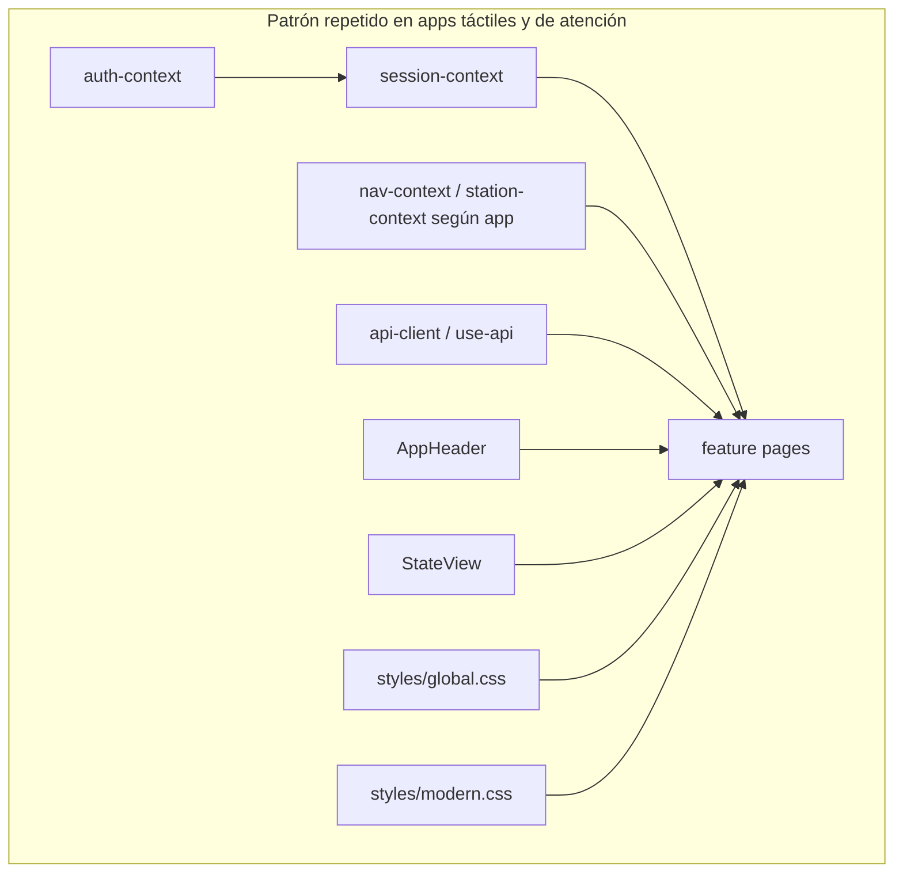
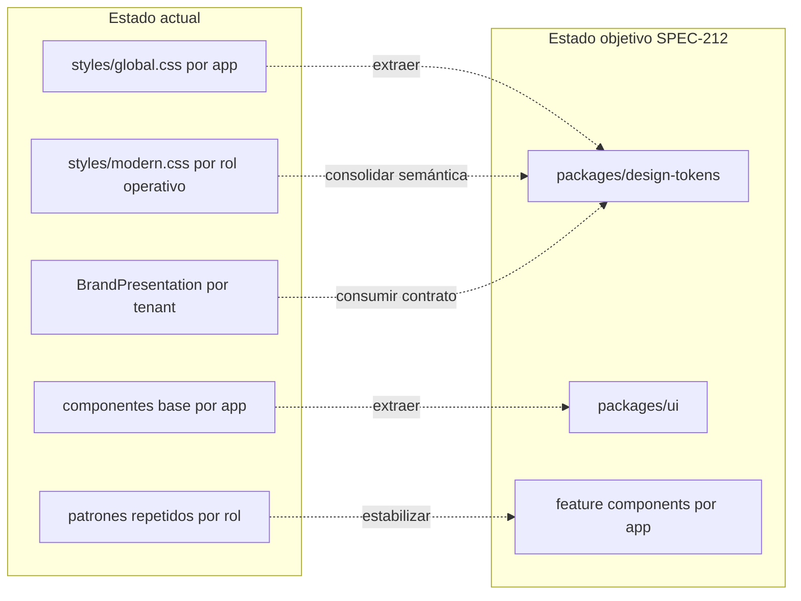
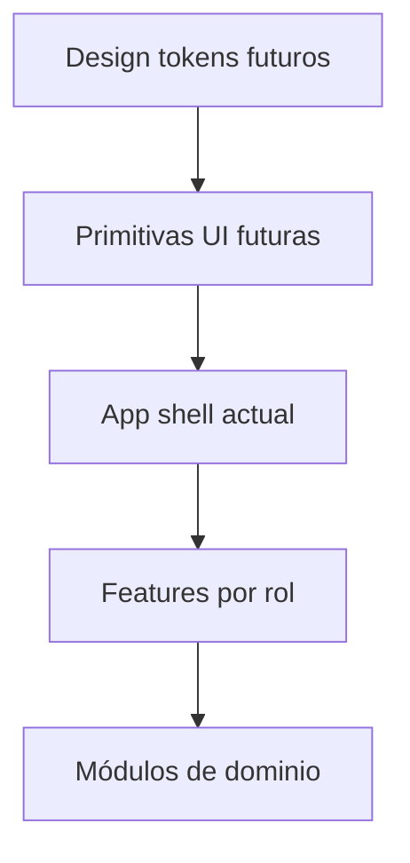
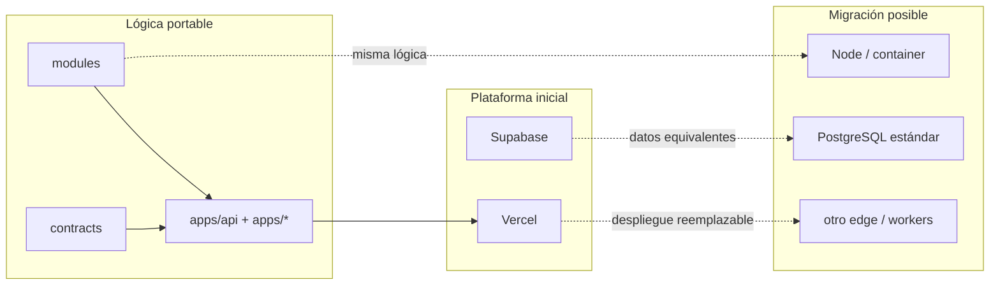

# Arquitectura, componentes y diseño — relevamiento visual

## Objetivo

Consolidar en una sola lectura la arquitectura actual de Maitre, la composición de componentes del repositorio y el estado del diseño de aplicaciones por rol.

Este documento no reemplaza las specs normativas. Las conecta visualmente.

## Hallazgos del relevamiento

- La arquitectura de negocio, plataforma y portabilidad ya está bien definida en foundations y SDD.
- El backend ya materializa con claridad el patrón `apps → modules → adapters`.
- En runtime operativo, Supabase ya es la persistencia/auth principal cuando hay credenciales;
  `memory`/`fixture` quedan como fallback local para tests o builds sin configuración.
- El backend ya tiene adapters Supabase para fiscal, y el rollout de tablas quedó
  aplicado en el proyecto conectado mediante `supabase/migrations/20260727143000_fiscal_domain.sql`.
- El flujo fiscal técnico ya fue validado end-to-end contra Supabase: create →
  validate → issue → QR. La autorización ARCA sigue simulada, no legalmente productiva.
- La estrategia multiapp por rol ya existe en implementación: `web`, `customer`, `waiter`, `host`, `kitchen`, `cashier`, `api`.
- La dirección visual por rol ya está materializada en las seis superficies frontend. Customer usa
  presentación editorial de marca y las apps operativas incorporan una capa `modern.css` propia,
  cargada después de los estilos históricos.
- La semántica compartida sigue más madura en spec que en paquetes: aún no existen `packages/ui`
  ni `packages/design-tokens`. La implementación actual prueba patrones y firmas visuales antes de
  decidir qué merece extracción transversal.
- SPEC-212 y este relevamiento conectan arquitectura, UX operativa, branding multi-tenant y
  composición del monorepo sin exigir que todas las apps tengan la misma apariencia.

## Cobertura documental actual

| Área | Documento principal | Estado actual |
| --- | --- | --- |
| Principios de arquitectura | [10-architecture-principles.md](10-architecture-principles.md) | Bien definido, pocas vistas integradas |
| Monorepo y boundaries | [SPEC-209](../sdd/spec-209-transversal-monorepo-architecture/specification.md) | Bien definido, foco normativo |
| Diseño y accesibilidad | [SPEC-212](../sdd/spec-212-transversal-design-system-accessibility/specification.md) | Dirección por rol implementada; paquetes y automatización pendientes |
| Apps y dispositivos | [15-applications-and-devices.md](../sdd/_guides/15-applications-and-devices.md) | Definido y reflejado en las superficies actuales |
| Stack técnico | [TECH_STACK.md](../sdd/TECH_STACK.md) | Claro, orientado a plataforma |

## Estado operativo relevado al 28 de julio de 2026

| Área | Estado runtime validado | Nota |
| --- | --- | --- |
| API local `apps/api` | Operativa contra Supabase | `/health/live` y `/health/ready` responden OK |
| Auth / contexto | Operativo | `/v1/me/context` responde `401` limpio sin bearer |
| Datos organization/floor/reservations/ordering/kitchen/cash | Presentes en Supabase | hay datos reales mínimos para prueba manual |
| Fiscal | Operativo en modo simulado | schema aplicado, seed fiscal creado y emisión live `FACTURA_A` validada; ARCA real sigue pendiente |
| Fallback memory/fixture | Sólo soporte local/test | no forma parte del runtime operativo principal |
| Customer público | Desplegado | home editorial Casa Maitre, menú, sucursales, reserva y cuenta separados |
| Apps por rol | Desplegadas | Waiter, Host, Kitchen, Cashier y Dash poseen identidad visual y URL independientes |
| QA visual | Baseline manual ejecutado | builds TypeScript/Vite y capturas responsive validadas; regresión automatizada sigue pendiente |

### Superficies productivas verificadas

| App | URL | Dirección actual |
| --- | --- | --- |
| Customer | `https://maitre-customer.vercel.app` | editorial cálida, gobernada por `BrandPresentation` |
| Waiter | `https://maitre-waiter.vercel.app` | brutalismo táctil, negro y lima |
| Host | `https://maitre-host.vercel.app` | espacial y hospitalaria, violeta y coral |
| Kitchen | `https://maitre-kitchen.vercel.app` | industrial de alta visibilidad, negro y amarillo |
| Cashier | `https://maitre-cashier.vercel.app` | libro mayor contemporáneo, petróleo y menta |
| Dash | `https://maitre-dash.vercel.app` | editorial de control, marfil, tinta y azul |

## Vista 1 — Plataforma operativa completa

> Nota: esta vista muestra el runtime operativo principal actual. El adapter
> `persistence/memory` existe sólo como fallback local/test y queda fuera de esta
> vista para no confundirlo con la operación real sobre Supabase.

### Evidencia operativa reciente

- El 27 de julio de 2026 se aplicó la migration fiscal `20260727143000_fiscal_domain.sql`
  al proyecto Supabase conectado.
- Ese mismo día se validó un flujo fiscal live completo sobre Supabase:
  `create → validate → issue → QR`.
- La validación emitió una `FACTURA_A` técnica con CAE simulado; prueba wiring
  end-to-end, no habilitación fiscal legal real.

## Vista 2 — Apps, roles y modo de interacción

## Vista 3 — Monorepo actual

## Vista 4 — Flujo sincrónico principal

## Vista 5 — Flujo asíncrono y coordinación entre dominios

## Vista 6 — Componentes de frontend actuales

### Lectura del relevamiento

- El patrón de app shell está bastante consolidado.
- La reutilización real hoy es **por copia convergente**, no por paquete compartido.
- Waiter, Host, Kitchen, Cashier y Dash cargan una capa visual final `modern.css` para aislar la
  identidad del rol de las reglas históricas y del branding inline. Customer conserva su capa
  editorial específica y consume `BrandPresentation`.
- Los tokens de marca identifican al tenant; foco, contraste, urgencia y estados operativos pueden
  fijar tokens gobernados por SPEC-212 cuando su significado no debe variar por marca.
- Esto confirma que `packages/ui` y `packages/design-tokens` siguen siendo una **siguiente extracción razonable**, no un prerrequisito para seguir iterando producto.

## Vista 7 — Diseño: estado actual vs estado objetivo

## Vista 8 — Ownership de componentes y responsabilidades

### Regla práctica

- `packages/design-tokens`: semántica visual y escala.
- `packages/ui`: primitivas sin negocio.
- `apps/*/features/*`: experiencia concreta por rol.
- `packages/modules/*`: reglas e invariantes.

## Vista 9 — Portabilidad de despliegue

## Vista 10 — Gap map documental e implementación

| Tema | Definición spec | Implementación actual | Gap principal |
| --- | --- | --- | --- |
| Multiapp por rol | Alta | Alta | Consolidar ownership y navegación cruzada |
| Monorepo por módulos | Alta | Alta | Mantener vistas sincronizadas con nuevas apps/paquetes |
| UI compartida | Alta | Media/Baja | Extraer de apps a paquetes |
| Design tokens | Alta | Media | Tokens probados en CSS por rol; falta paquete compartido |
| Device strategy touch/non-touch | Alta | Alta | Materializada en jerarquía, densidad y contraste por app |
| Identidad visual por rol | Alta | Alta | Automatizar regresión y pruebas de accesibilidad |
| Branding multi-tenant | Alta | Alta | Mantener separación entre marca y estados operativos |
| Arquitectura visual para onboarding | Alta | Media/Alta | Foundation 18 y SPEC-212 cubren el mapa; faltan artefactos ejecutables |

## Recomendaciones de continuidad

1. Usar este documento como mapa de onboarding técnico y de producto.
2. Mantener [10-architecture-principles.md](10-architecture-principles.md), [SPEC-209](../sdd/spec-209-transversal-monorepo-architecture/specification.md) y [SPEC-212](../sdd/spec-212-transversal-design-system-accessibility/specification.md) como fuentes normativas.
3. Extraer a `packages/ui` y `packages/design-tokens` sólo cuando el patrón ya esté probado en al menos dos apps.
4. Reducir progresivamente reglas históricas de `global.css` a medida que los patrones de
   `modern.css` demuestren estabilidad, sin hacer una migración visual masiva sin tests.
5. Incorporar screenshots de regresión y axe/teclado en CI antes de considerar completa SPEC-212.
6. Volver a actualizar estas vistas cada vez que cambie una de estas piezas:
   - una nueva app por rol;
   - una extracción a paquete compartido;
   - un cambio de despliegue;
   - un cambio fuerte del flujo operativo del restaurante.
