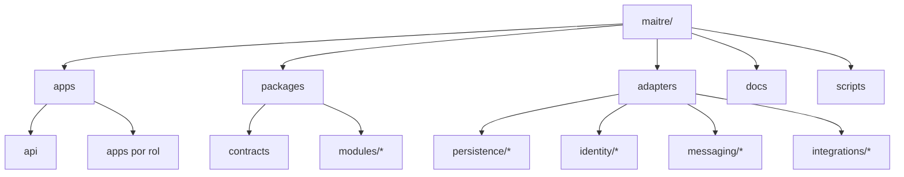
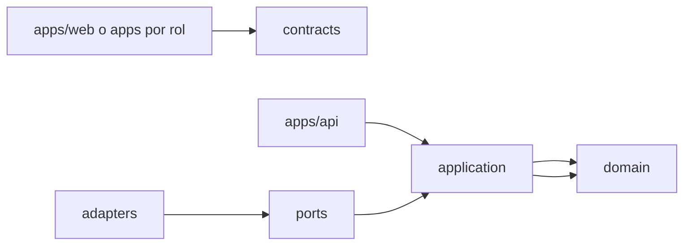

# SPECIFICATION — SPEC-209

## Estructura normativa



```text
maitre/
├── apps/
│   ├── web/                    # Aplicación React.js
│   └── api/                    # API y webhooks Node.js
├── packages/
│   ├── modules/                # Módulos de negocio con límites propios
│   │   ├── identity/           # domain + application + API pública
│   │   └── organization/       # domain + application + API pública
│   ├── contracts/              # DTOs, schemas, APIs y eventos públicos
│   ├── config/                 # Parsing tipado de configuración
│   ├── observability/          # Contratos y adaptadores base de telemetría
│   ├── ui/                     # Primitivas React compartidas aprobadas
│   ├── design-tokens/          # Tokens sin dependencia de React
│   ├── test-utils/             # Builders y fixtures sin datos reales
│   └── tooling/                # Config compartida, sin runtime productivo
├── adapters/
│   ├── persistence/            # Implementaciones de repositorios
│   ├── identity/               # Proveedor de identidad
│   ├── messaging/              # Eventos, jobs y notificaciones
│   ├── storage/                # Objetos
│   └── integrations/           # ARCA y proveedores externos
├── docs/                       # Foundations y SDD
├── scripts/                    # Automatización portable
└── package.json                # npm workspaces y comandos raíz
```

Los directorios se crean cuando contienen una primera necesidad aprobada. El scaffolding no debe generar paquetes vacíos salvo los mínimos requeridos para demostrar los límites.

## Dirección de dependencias



```text
apps/web --------------------> contracts
apps/api -----> application -> domain
    |               |           ^
    v               v           |
adapters --------> ports -------+

module/domain -> ninguna capa externa
module/application -> su domain + ports propios
adapters -> application ports + contratos del proveedor
apps -> composición, transporte y presentación
```

### Importaciones permitidas

| Origen | Puede importar |
| --- | --- |
| `modules/*/domain` | librería estándar y primitives puras aprobadas |
| `modules/*/application` | domain del mismo módulo y puertos propios |
| API pública de módulo | domain/application exportados deliberadamente |
| `contracts` | schemas/tipos sin lógica de infraestructura |
| `adapters/*` | `application`, `domain`, `contracts` y SDK del proveedor adaptado |
| `apps/api` | casos de uso, contratos y adaptadores durante composición |
| `apps/web` | contracts, config/browser, ui, design-tokens y código propio |

Un módulo no importa internals de otro. La colaboración ocurre mediante una API pública, un port o un evento explícito. No se crean paquetes globales `domain`, `application`, `common` o `shared` que acumulen conceptos no relacionados.

La matriz normativa completa está en [dependency-boundaries.md](dependency-boundaries.md).

## Workspaces y comandos raíz

Se usarán npm workspaces, consistente con SPEC-048. Todo desarrollador y CI opera desde comandos raíz:

```text
npm run format:check
npm run sdd:validate
npm run lint
npm run typecheck
npm run deps:check
npm run test:unit
npm run test:integration
npm run test:contract
npm run test:coverage
npm run build
npm run security:audit
npm run secrets:scan
npm run sonar
npm run test:e2e:smoke
```

Los scripts delegan a los workspaces afectados y devuelven código distinto de cero ante fallos.

> Vista relacionada: [Foundation 18 — Architecture, Components & Design Views](../../foundation/18-architecture-components-design-views.md)

## TypeScript

- Configuración base central y extensiones por runtime.
- `strict` habilitado.
- Sin alias que oculten dependencias entre capas.
- Tipos de dominio separados de DTOs externos.
- Entradas `unknown` validadas con schemas en las fronteras.
- Builds sin emitir artefactos en verificación de tipos.

## Contratos

`packages/contracts` contiene contratos de transporte versionados para:

- requests y responses HTTP;
- eventos de dominio publicados;
- webhooks;
- errores públicos;
- paginación y metadatos comunes.

Los tipos TypeScript se derivan de los schemas cuando sea posible. No se mantienen manualmente dos representaciones equivalentes.

Contracts no importa módulos de dominio. Cada route mapper traduce entre DTOs y tipos del módulo para impedir que una representación pública se convierta accidentalmente en entity.

## Composición

Solo los composition roots de cada aplicación conocen implementaciones concretas. Un caso de uso recibe sus puertos mediante construcción explícita; no consulta singletons globales de infraestructura.

## Estrategia de apps

### Web

- React.js y TypeScript.
- Presentación separada de consultas/comandos.
- Sin acceso directo a base de datos o secretos.
- Configuración pública validada al iniciar.

### API

- Node.js LTS fijado por el repositorio.
- Handlers delgados: parsear, autorizar, ejecutar caso de uso y mapear respuesta.
- Sin estado persistente en memoria o filesystem local.
- Arranque compatible con Vercel y con un proceso/contenedor estándar.

## Versionado interno

Los paquetes se versionan juntos durante el MVP. No se publican a un registry. Los cambios incompatibles en contratos requieren actualización atómica de consumidores y evidencia de contract tests.
