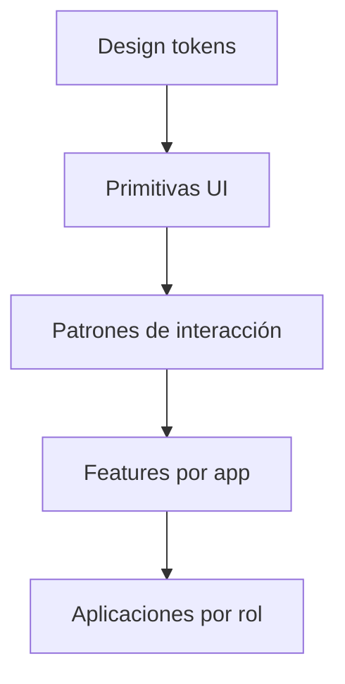

# Especificación — SPEC-212

## 1. Arquitectura del sistema de diseño



```text
Design tokens
  └── Primitives
      └── Interaction patterns
          └── Feature components
              └── Applications
```

- `packages/design-tokens`: valores semánticos serializables y CSS custom properties.
- `packages/ui`: primitivas y patrones React.js sin reglas de negocio.
- Cada `apps/*` compone esos elementos con casos de uso y permisos propios.
- Una feature no puede incorporarse a `packages/ui` hasta demostrar reutilización real o representar una primitiva transversal.

I0 implementa únicamente el inventario de [i0-component-scope.md](i0-component-scope.md). Los patrones de otras superficies permanecen diseño futuro y no crean componentes vacíos.

> Vista relacionada: [Foundation 18 — Architecture, Components & Design Views](../../foundation/18-architecture-components-design-views.md)

## 2. Tokens

Los tokens constituyen la fuente de verdad y se nombran por intención, no por valor:

- color: `surface`, `text`, `border`, `action`, `status`, `focus` y sus variantes;
- tipografía: familia, tamaño, altura de línea, peso y tracking;
- espacio: escala base de 4 px con hitos principales cada 8 px;
- forma: radios, bordes, elevación y opacidad;
- interacción: duración, easing, foco, target y estados;
- layout: breakpoints orientativos, anchos máximos y densidad por contexto;
- capas: escala documentada de `z-index`.

Los componentes no usan colores hexadecimales, sombras o `z-index` arbitrarios. Los temas sobrescriben tokens semánticos, no la estructura del componente.

SPEC-232 define los tokens de marca publicados por tenant/brand y su aplicación multiapp. Los tokens
de estado crítico, foco y contraste permanecen gobernados por este sistema de diseño.

## 3. Accesibilidad

La conformidad objetivo es WCAG 2.2 nivel AA para flujos completos.

- HTML semántico y controles nativos antes que roles ARIA.
- Toda función debe operar con teclado y puntero, sin trampas de foco.
- El orden visual debe conservar el orden lógico del DOM.
- El foco es visible, no queda oculto por headers, overlays o barras fijas y usa contraste suficiente.
- Texto normal alcanza contraste 4.5:1; texto grande, 3:1; controles y gráficos necesarios, 3:1.
- Ningún estado, prioridad, alérgeno o resultado se comunica solamente mediante color.
- Los controles operativos tienen un área interactiva mínima de 44×44 CSS px. Las excepciones de texto inline deben conservar separación y alternativa accesible.
- Zoom a 200 %, reflow a 320 CSS px y tamaño de texto del sistema no deben ocultar acciones esenciales.
- Movimiento no esencial respeta `prefers-reduced-motion`; no se usan destellos peligrosos.
- Errores identifican el campo, explican la corrección y se anuncian sin perder el dato ingresado.
- Cambios asíncronos importantes usan regiones vivas con moderación; nunca producen anuncios repetitivos.
- Arrastrar siempre tiene una alternativa de toque/clic o teclado.

## 4. Interacción operativa

- Touch-first, con soporte completo de teclado y mouse.
- Acciones frecuentes son visibles y directas; menús secundarios no ocultan la tarea principal.
- Las áreas críticas muestran sucursal, turno y contexto activo cuando una confusión pueda afectar la operación.
- Estados offline, sincronizando, actualizado, degradado y error son persistentes, legibles y accionables.
- Optimistic UI sólo se usa si el rollback es claro y no afecta dinero, fiscalidad, alérgenos o acciones irreversibles.
- Acciones destructivas, fiscales o monetarias requieren intención explícita y resumen previo; una confirmación no debe ser rutina para acciones reversibles.
- Loading preserva el layout; operaciones largas informan progreso o estado, sin spinners indefinidos.

## 5. Responsive y dispositivos

El diseño es mobile-first y fluido. Los breakpoints responden al contenido, no a modelos de dispositivos.

| Contexto | Prioridad de diseño |
| --- | --- |
| Guest, teléfono 5.5–6.5″ | una mano, lectura, QR, máximo 3 taps para pedir |
| Floor, tablet 7–10″ | mapa y acciones rápidas; teléfono como fallback |
| Kitchen, tablet | distancia, alto contraste, targets amplios, estado inmediato |
| Cash, computadora/tablet | teclado eficiente, precisión monetaria, auditoría |
| Dash, computadora/tablet | exploración, tablas, filtros y densidad controlada |
| Connect, computadora | configuración guiada, permisos y diagnóstico |

Las tablas deben ofrecer una representación útil en pantallas angostas; no se permite ocultar datos esenciales sin una alternativa. Kitchen puede adoptar un tema de alta visibilidad validado, pero no se asume dark mode como solución universal.

## 6. Componentes React.js

- TypeScript estricto y API pública pequeña, coherente y documentada.
- `forwardRef` sólo cuando exista un caso de interoperabilidad; composición antes que props booleanas combinatorias.
- Estado controlado y no controlado sigue convenciones React y se documenta.
- Primitivas no consultan APIs, stores globales, permisos ni reglas del dominio.
- HTML nativo es la primera opción. Si ADR-004 acepta Radix UI, puede respaldar interacciones complejas encapsulado detrás de la API de Maitre.
- Si ADR-004 acepta Tailwind CSS, consume variables semánticas y no convierte clases arbitrarias en una segunda fuente de tokens.
- Los íconos pasan por componentes propios. Si ADR-004 acepta Lucide React, sigue siendo reemplazable; un ícono decorativo se oculta y uno significativo posee texto visible o nombre accesible.
- Cada componente incluye estados default, hover, active, focus, disabled, loading, error y empty cuando correspondan.

## 7. Contenido y localización

- Español de Argentina es el locale inicial (`es-AR`).
- Fechas, horas, moneda y números usan `Intl`; no se concatenan formatos manualmente.
- Los textos de producto viven fuera de componentes reutilizables y admiten expansión de longitud.
- Labels describen la acción (`Emitir factura`) y no su posición (`Continuar`).
- Mensajes de error explican qué ocurrió y cómo recuperarse, sin códigos internos como único contenido.

## 8. Documentación y pruebas

La documentación de componentes debe ejecutarse localmente y generar un artefacto estático. Storybook es candidato sujeto a ADR-004/SPK-05; no se requiere SaaS.

Cada componente nuevo incluye:

- stories de estados y tamaños relevantes;
- prueba de comportamiento con Testing Library;
- chequeo axe-core sin violaciones conocidas;
- navegación por teclado para interacciones complejas;
- pruebas Playwright de los flujos críticos;
- screenshots estables para un conjunto pequeño de vistas representativas.

La automatización complementa revisiones manuales con teclado, lector de pantalla, zoom, contraste, touch y conectividad degradada.

## 9. Gate de dependencias UI

Antes de adoptar Tailwind, Radix, Lucide o Storybook, ADR-004 registra evidencia de:

- tamaño del build base y delta por dependencia realmente usada;
- accesibilidad/teclado del patrón I0;
- posibilidad de tree-shaking y ausencia de runtime server-only;
- mantenimiento/licencia y actualizaciones;
- tiempo cold/warm de build/test en SPK-05;
- reemplazo detrás de tokens/componentes propios.

Un resultado pendiente o inconclusive permite implementar HTML/CSS nativo mínimo, pero no incorporar el candidato como estándar.
